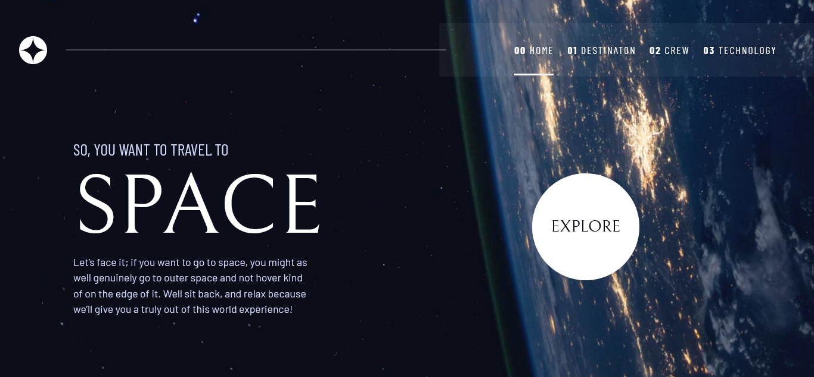
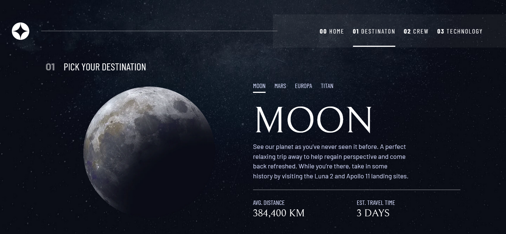
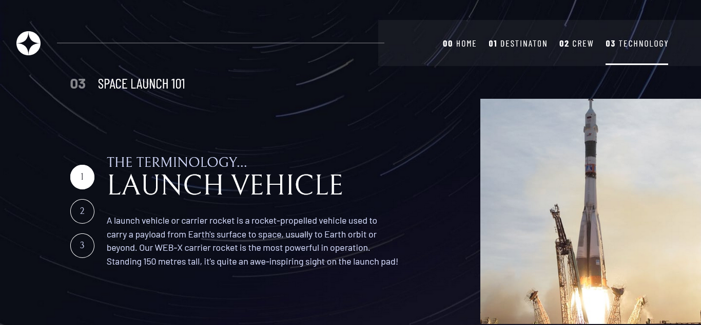

# Space tourism website

"Space Tourism Website" foi desenvolvido com foco em acessibilidade, arquitetura limpa e abordagem desktop-first.

---

## Visão Geral

Este projeto foi desenvolvido como parte de um desafio do Frontend Mentor.  
O objetivo principal foi construir uma aplicação front-end fiel ao design proposto, utilizando boas práticas de desenvolvimento, semântica HTML, acessibilidade e organização de código.

---
## screenshots






---

## Links

- Solução no Frontend Mentor: [link]
- Repositório no GitHub: [link]
- Preview / Deploy: [link]

---

## Tecnologias Utilizadas

- HTML5 semântico
- CSS3 (Grid, Flexbox, Custom Properties)
- Svelte 5 e SvelteKit

---

## Arquitetura e Estrutura

O projeto foi estruturado com foco em escalabilidade e legibilidade:

- Separação clara entre layout, páginas e componentes
- Estilos organizados por responsabilidade (tokens, base, layout, componentes)
- Componentes reutilizáveis e desacoplados
- Abordagem desktop-first

**Estrutura de pastas:**

```
├── src/
│   ├── lib/
│   │   ├── components/
│   │   │   ├── Dots.svelte
│   │   │   ├── Header.svelte
│   │   │   ├── NumberedTabs.svelte
│   │   │   └── Tabs.svelte
│   │   ├── data/
│   │   │   └── data.json
│   │   ├── styles/
│   │   │   ├── components/
│   │   │   │   ├── header.css
│   │   │   │   └── home.css
│   │   │   ├── base.css
│   │   │   ├── layout.css
│   │   │   └── tokens.css
│   │   └── index.js
│   ├── routes/
│   │   ├── crew/
│   │   │   └── +page.svelte
│   │   ├── destination/
│   │   │   └── +page.svelte
│   │   ├── technology/
│   │   │   └── +page.svelte
│   │   ├── +layout.svelte
│   │   └── +page.svelte
│   └── app.html
├── static/
│   ├── assets/
│   │   ├── crew/
│   │   ├── destination/
│   │   ├── home/
│   │   ├── shared/
│   │   ├── technology/
│   │   └── favicon-32x32.png
│   └── robots.txt
├── .gitignore
├── .npmrc
├── .prettierignore
├── .prettierrc
├── eslint.config.js
├── jsconfig.json
├── package-lock.json
├── package.json
├── README.md
├── Style Guide.png
├── svelte.config.js
└── vite.config.js
```

---

## Acessibilidade

Foram aplicadas boas práticas de acessibilidade, incluindo:

- HTML semântico
- Estados de foco visíveis (`:focus-visible`)
- Uso correto de atributos ARIA

---

## Layout e Responsividade

- Layout desenvolvido com abordagem **desktop-first**
- Uso de CSS Grid e Flexbox
- Adaptação para diferentes tamanhos de tela
- Imagens responsivas e fundos por página

---

## Funcionalidades

- Navegação entre páginas sem recarregamento
- Componentes interativos (tabs, sliders, menus)
- Estados ativos visuais
- Menu mobile acessível

---

## Aprendizados

Durante o desenvolvimento deste projeto, foi possível aprofundar meus conhecimentos em:

- Arquitetura de projetos front-end
- Organização de CSS em projetos reais
- Acessibilidade aplicada na prática
- Uso de frameworks modernos de forma consciente
- Leitura e interpretação de layouts profissionais
